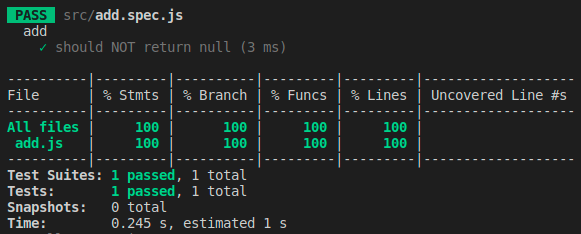

# Code Coveage Fallacy
This repo is designed to highlight the fallacies of having 100% code coverage.

## Why?
I have worked for many companies and some of them have set goals like: 
> We must attain 95% code coverage

But this coverage statistic tells you nothing about the quality of your tests or whether the code you are writing is doing what it's supposed to.

I'll give you an example so you can judge for yourself...

## Example
In the `src` folder, you'll find a very basic `add.js` file which contains a function that does some basic maths:

```
const add = (n) => {
    const a = n + 1;
    const b = n * n;
    const c = n + n + n;
    const d = n + 7;

    return {
        a,
        b,
        c,
        d
    };
}
```

So this super simple function takes a number as an argument `n` and then performs some maths to derive the `a`, `b`, `c` & `d` property values that it returns.

Now although there is only simple maths going on here, it is doing quite a few things.

### 100% Code Coverage from 1 test
To attain 100% code coverage of this function and keep our code coverage goal satisfied, we can do but 1 simple test `add.spec.js`:
```
describe('add', () => {
    it('should NOT return null', () => {
        const actual = add(1);

        expect(actual).not.toEqual(null);
    });
});
```

Go ahead, clone this repo, run `npm install`, followed by `npm test` and feast your eyes on your achievement:



# So what? It's got 100% coverage?
Take a close look at what the `add` functions does and what the test is checking. There is no testing to check any of the properties are computed correcty. Neither does it check what happens when values other than a single digit integar are passed to it.

It is actually suprisingly easy to attain 100% code coverage, but this does not mean you've done good testing.